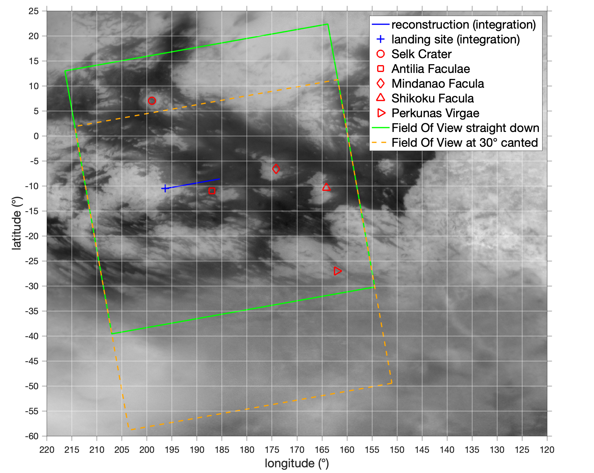

# EDL
This is the repository for my final project in AE 6355 - EDL.

### MATLAB (Easy Way)
The reader is invited to use the MATLAB scripts to reproduce the plots.
- draw_plots_planar to have the plots of the atmospheric models, and the planar reentry
- draw_map_comparison to have the plots of the reentry compared to Kazeminejad et al. on Titan map
- draw_map_FOV to have the map of Titan with the Field of View and the Features
- draw_validation_COV to have the validation of the covariance propagation
- draw_ellipsoids to have the plots of the final ellipsoids
- Other functions are there to triangulate etc, but they are not run on their own.

### OUTPUT
Some csv simulation are already in the output folder and are used by the MATLAB scripts.

### CCDODE
The ccode folder contains the c++ simulation framework. It uses Eigen for linear algebra, and *it is important that you properly link Eigen* in your terminal.
- Run the main is the easy way
- OEM is a class representing the equations of motion using all the classes hereafter
-- Yelle and Exponential atmospheric models are implemented
-- Vehicle is also created
-- Integrator contains a Runge-Kutta 4th order
- covariances has some functions to find the sensitivities and propagate the covariance to the ground

command I used, feel free to modify it:

clang++ -std=c++11 -stdlib=libc++ -I /Users/sebastienhenry/Documents/GTSAM/gtsam/gtsam/3rdparty/Eigen/ ../ccode/ccode/main.cpp ../ccode/ccode/atmospheric_model.cpp ../ccode/ccode/EOM.cpp ../ccode/ccode/integrator.cpp ../ccode/ccode/vehicle.cpp -o ../build/to_exec

